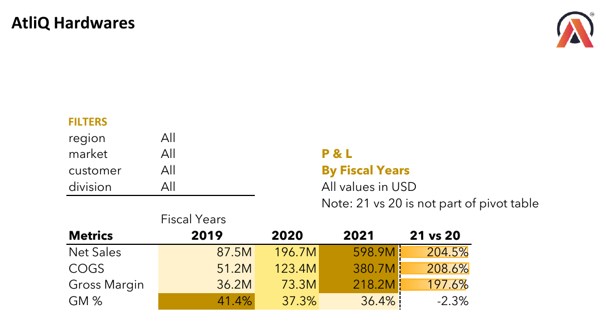
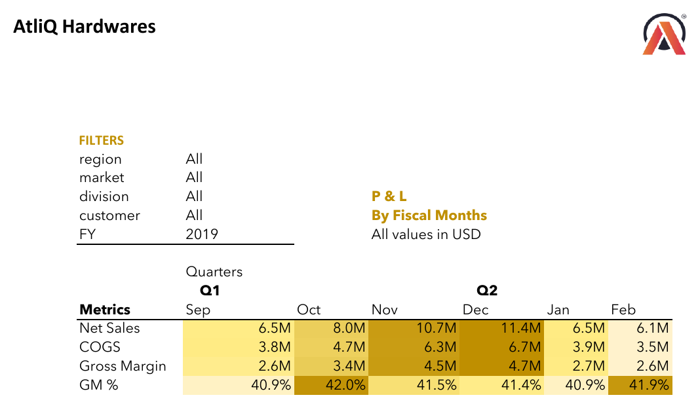
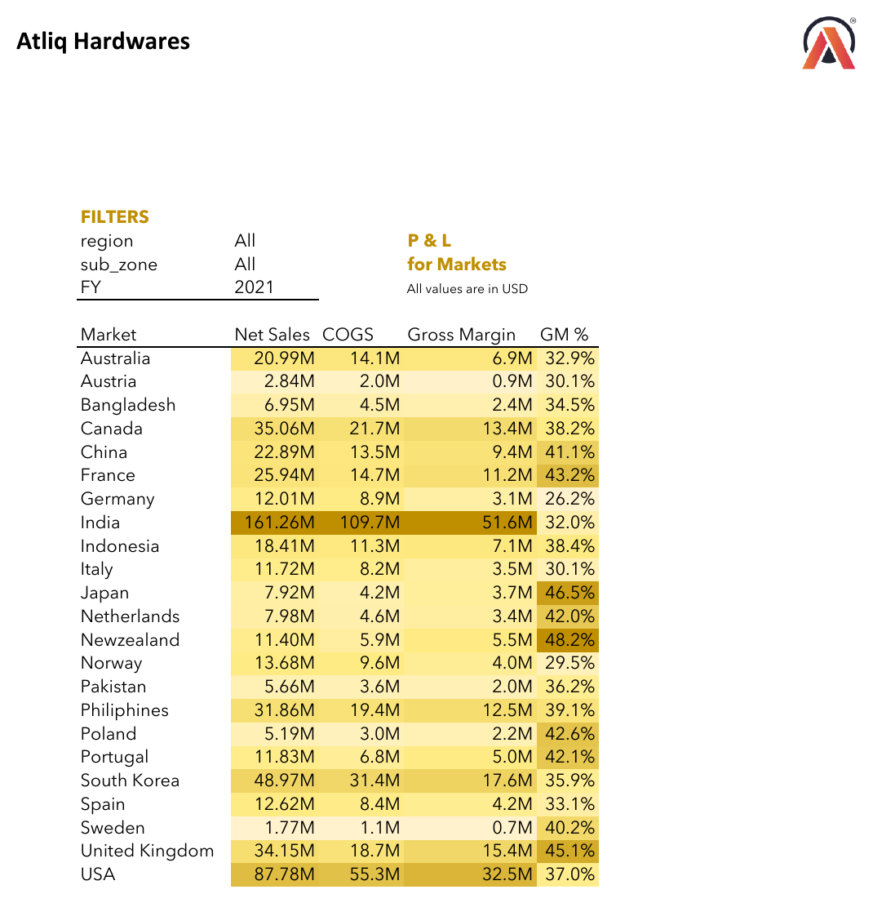
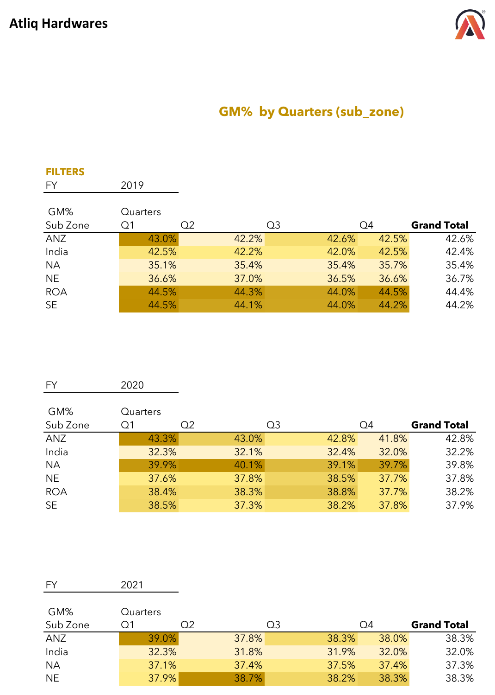
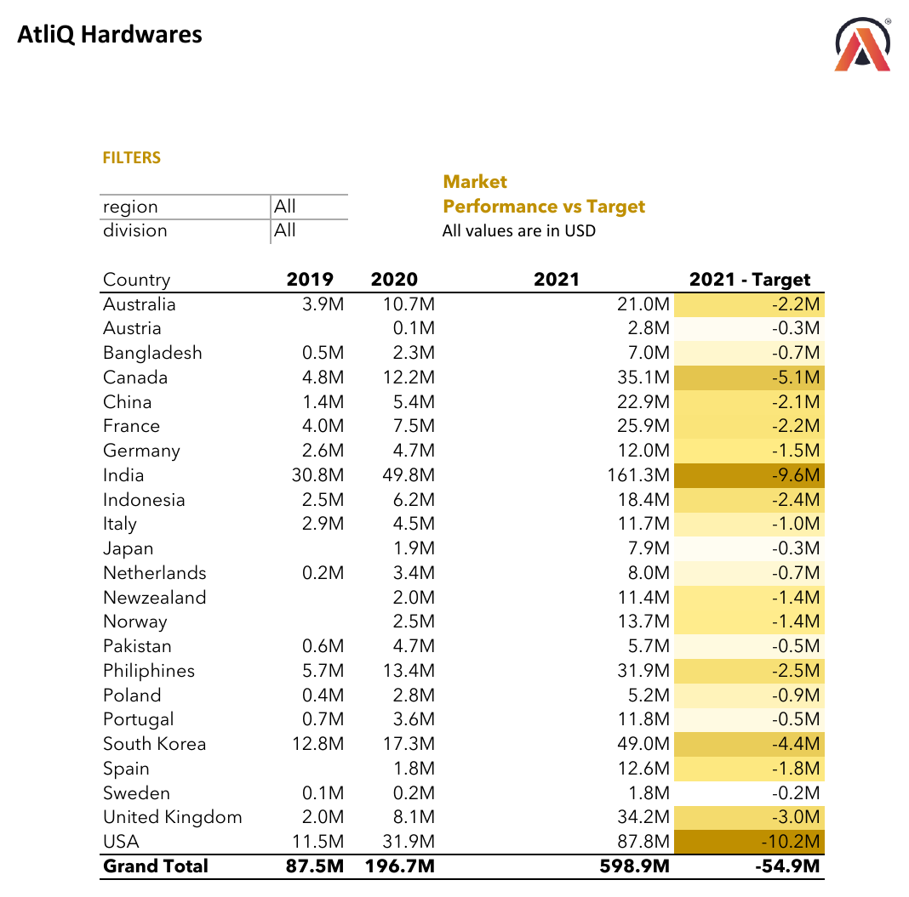
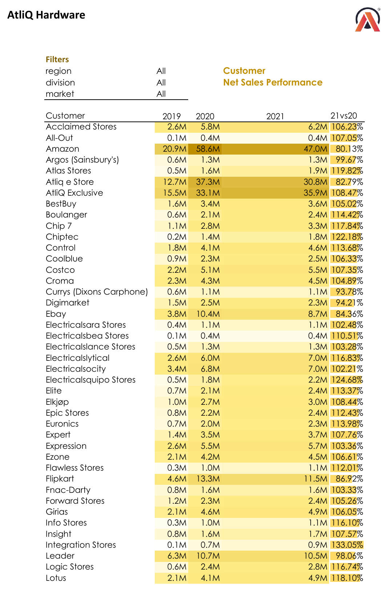

# 📊 AtliQ Hardwares — Sales & P&L Performance Analytics (Excel)

An Excel-based financial and sales analytics project for **AtliQ Hardwares**, a global consumer electronics hardware company. Built on a relational data model (fact + dimension tables) and PivotTables/PivotCharts, the workbook set breaks down Net Sales, COGS, and Gross Margin performance across fiscal years, months, markets, sub-zones, and customers — plus market performance against sales targets.

---

## 📌 Overview

Rather than a single flat report, this project is a small **data model** built in Excel: a `fact_sales_monthly` table related to `dim_date`, `dim_market`, `dim_customer`, and `dim_product` dimension tables, with `ns_targets_2021` layered in for target-vs-actual analysis. PivotTables sit on top of this model to slice Net Sales, COGS, and Gross Margin % by fiscal year, fiscal month, market, sub-zone, and customer — the same kind of structure a finance/FP&A analyst would use to close out a period and report performance.

---

## 🎯 Business Problem

AtliQ Hardwares sells across 20+ countries and 100+ retail customers (Amazon, Flipkart, Costco, Walmart, Croma, and others). Without a consolidated model, it's hard to answer: is the company hitting its 2021 sales targets by country, which markets and sub-zones are dragging down gross margin, which customers are growing vs. shrinking year-over-year, and how did performance trend month-to-month within the fiscal year.

## 🎯 Goal of the Project

- Track Net Sales, COGS, Gross Margin, and GM% across FY2019–FY2021
- Compare 2021 actual Net Sales against target, by country
- Break down GM% by sub-zone (ANZ, India, NA, NE, ROA, SE) and by quarter
- Surface fiscal-month seasonality within each year (Q1–Q4)
- Rank customer-level Net Sales performance and YoY growth (21 vs 20)
- Roll all of the above up into a market-by-market P&L view

---

## 📁 Report Views

### 1. P&L Statement by Fiscal Year
Net Sales, COGS, Gross Margin, and GM% for FY2019, FY2020, and FY2021, with a 21-vs-20 growth column. Net Sales grew from $87.5M (2019) to $598.9M (2021), while GM% compressed slightly from 41.4% to 36.4%.

📄 [View PDF](https://github.com/Prerak7999/Excel-Sales_Analysis/blob/main/PL_Statement_by_Fiscal_Year.pdf)

### 2. P&L Statement by Fiscal Months
The same P&L metrics broken out by fiscal month (Sep–Aug) and rolled into quarters (Q1–Q4), for a single selected fiscal year — used to spot seasonality within the year.

📄 [View PDF](https://github.com/Prerak7999/Excel-Sales_Analysis/blob/main/P%26L%20Statement%20by%20Months.pdf)

### 3. P&L Statement by Markets
Net Sales, COGS, Gross Margin, and GM% for FY2021, broken out by all 22 markets — from a $1.77M market (Sweden) up to $161M (India) and $87.8M (USA).

📄 [View PDF](https://github.com/Prerak7999/Excel-Sales_Analysis/blob/main/P%26L%20Statement%20by%20Markets.pdf)

### 4. Gross Margin % by Sub-Zone
GM% by quarter for each sub-zone (ANZ, India, NA, NE, ROA, SE), shown separately for FY2019, FY2020, and FY2021 — isolating which regions carry the strongest/weakest margins and how that's shifted year over year.

📄 [View PDF](https://github.com/Prerak7999/Excel-Sales_Analysis/blob/main/Gross_Margin_by_Sub_Zone.pdf)

### 5. Market Performance vs. Target
2019–2021 Net Sales by country against a 2021 sales target, with a 2021-vs-target variance in both $ and %. Two versions are included — an early cut (all markets short of target by roughly -9% on average) and a later, more conservative target-setting cut (markets averaging roughly -88% below target).

📄 [View PDF (v1)](https://github.com/Prerak7999/Excel-Sales_Analysis/blob/main/Market_Performance_vs_Sales%20target.pdf) · [View PDF (v2)](https://github.com/Prerak7999/Excel-Sales_Analysis/blob/main/market%20and%20target%20performance.pdf)

### 6. Customer Net Sales Performance
Net Sales by customer (Amazon, Flipkart, Costco, Croma, Walmart, and 70+ others) for FY2019–FY2021, with a 21-vs-20 growth % per customer — used to flag which accounts are growing, flat, or declining.

📄 [View PDF](https://github.com/Prerak7999/Excel-Sales_Analysis/blob/main/customer%20net%20sales%20performance%20.pdf)

---

## 🛠️ Tech Stack

- **Microsoft Excel** — data modeling and report authoring
- **Excel Data Model / Power Pivot** — relates `fact_sales_monthly` to `dim_date`, `dim_market`, `dim_customer`, `dim_product`
- **PivotTables** — all six report views are PivotTable-driven, filterable by region, division, market, customer, and fiscal year
- **Conditional Formatting** — color-scaled tables (data bars / color scales) highlighting high/low values across markets, customers, and sub-zones

## 🧮 Key Metrics

| Metric | What it shows |
|---|---|
| `Net Sales` | Top-line revenue by year / month / market / customer |
| `COGS` | Cost of goods sold, same cuts as Net Sales |
| `Gross Margin` | Net Sales − COGS |
| `GM %` | Gross Margin ÷ Net Sales — the core profitability lens |
| `21 vs 20` | Year-over-year growth %, Net Sales or Gross Margin |
| `2021 - Target` | Actual vs. target variance, in $ and % |

## 📁 File Format

- `.xlsx` — full working workbooks with the underlying data model and PivotTables (open in Excel)
- `.pdf` — printable/shareable exports of each report view

---

## 📥 Download

- [P&L Statement by Fiscal Year](https://github.com/Prerak7999/Excel-Sales_Analysis/blob/main/PL_Statement_by_Fiscal_Year.pdf)
- [P&L Statement by Months](https://github.com/Prerak7999/Excel-Sales_Analysis/blob/main/P%26L%20Statement%20by%20Months.pdf)
- [P&L Statement by Markets](https://github.com/Prerak7999/Excel-Sales_Analysis/blob/main/P%26L%20Statement%20by%20Markets.pdf)
- [Gross Margin % by Sub-Zone](https://github.com/Prerak7999/Excel-Sales_Analysis/blob/main/Gross_Margin_by_Sub_Zone.pdf)
- [Market Performance vs. Sales Target](https://github.com/Prerak7999/Excel-Sales_Analysis/blob/main/Market_Performance_vs_Sales%20target.pdf)
- [Market and Target Performance (alt. cut)](https://github.com/Prerak7999/Excel-Sales_Analysis/blob/main/market%20and%20target%20performance.pdf)
- [Customer Net Sales Performance](https://github.com/Prerak7999/Excel-Sales_Analysis/blob/main/customer%20net%20sales%20performance%20.pdf)
